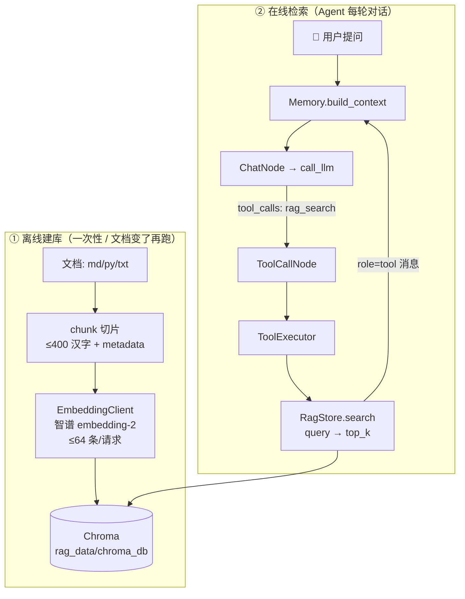
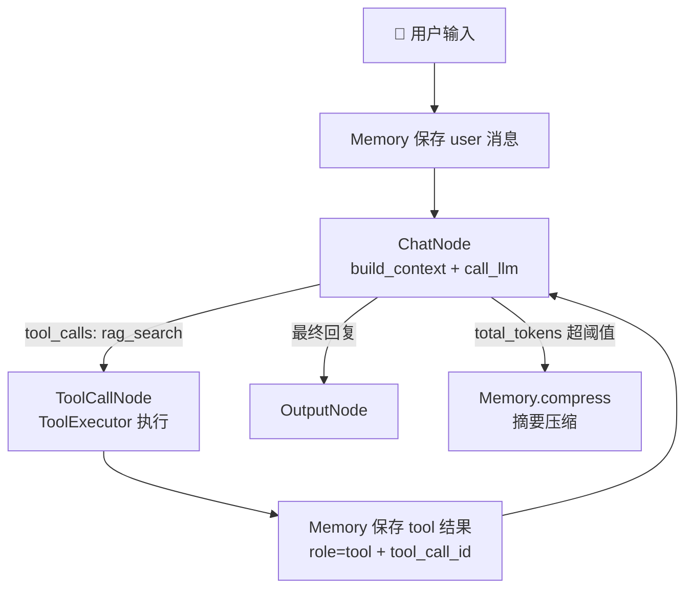

# 🧭 给 Agent-Learn 添加 RAG：详细构建步骤

<!-- markdownlint-disable MD033 -->

> 🎯 目标：按 README 第 3 条的提示（**选 Chroma + 一个 embedding model api**），在这套 `Node / Flow / tools / Memory` 工程里**从零接出一个能用的 RAG 系统**。
> 📌 结论先放前面：按 README 的说法 **RAG = VectorDB，只用到"检索"这一步** —— 所以我们真正要做的只有三件事：**写一个 embedding 适配器** → **把文档切块灌进 Chroma** → **把检索包装成一个 Tool 交给 Agent 调用**。

---

## 0. 先盘点：README 给了什么提示，工程里已有什么

### 📖 README 的 4 条提示（对应到要做的事）

| README 原话 | 落到工程里的动作 |
| --- | --- |
| "选择 Chroma 而不是 Milvus / LanceDB / pgvector，因为部署简单、api 简洁" | `pyproject.toml` 里已有 `chromadb`，本机实装 **chromadb 1.5.9**，直接用 `PersistentClient` 本地嵌入式模式，**不需要起服务** |
| "你可能需要一个 **embedding model api 而不是 llm api**" | `.env` 里已备好独立的 `EMBEDDING_API_KEY / EMBEDDING_BASE_URL / EMBEDDING_MODEL_ID`（智谱 `embedding-2`），**不要复用 `OPENAI_API_KEY`** |
| "VectorDB 就能很完美执行这个任务" | 检索能力收进 `core/rag/`，对外只暴露一个 `rag_search` 工具，**不要造"检索-增强-生成"三段式大框架** |
| 全篇的工程哲学：Tool 就是一个函数 + 注册表；能不加抽象就不加 | RAG 接入方式与 `ls / grep / search` **完全一致**：写函数 → 在 `get_builtin_tools()` 注册 → `executor` 自动认得 |

### 🗂️ 工程现状盘点（都已在仓库里，无需从零搭）

| 已有资产 | 位置 | 对本任务的意义 |
| --- | --- | --- |
| 依赖 | `pyproject.toml` → `chromadb>=0.5.0`（实装 1.5.9） | ✅ 不用 `uv add`，`uv sync` 即可 |
| Embedding 配置 | `.env` → `EMBEDDING_API_KEY / EMBEDDING_BASE_URL / EMBEDDING_MODEL_ID` | ✅ 已配好，默认智谱 `embedding-2` |
| 持久化目录配置 | `.env` → `# CHROMA_PERSIST_DIR=./rag_data/chroma_db/`（注释状态） | ⚙️ 代码里给默认值，需要时再打开 |
| 忽略规则 | `.gitignore` → `rag_data/` | ✅ 向量库不会进 git |
| 工具契约 | `tools/builtins/tool_def.py` → `Tool(name, description, parameters, fn)` | ✅ 照抄 `search` 工具即可 |
| 工具注册表 | `tools/builtins/tool_def.py` → `get_builtin_tools()` | ✅ 加一个 `Tool(...)` 就接入 Agent |
| 执行桥 | `tools/executor.py` → `ToolExecutor` | ✅ 不用改任何代码，自动识别新工具 |
| 可抄的样例 | `examples/chatbot_with_tools/main.py`、`examples/chatbot_with_memory/main.py` | ✅ RAG 示例就是它们 + 一个工具 |

### 🔬 动手前先做的实测（本会话在 `.venv` 里真跑过，直接引用结论）

这几条是后面所有设计决策的依据，**不是猜的**：

| 实测项 | 结果 | 影响的设计决策 |
| --- | --- | --- |
| 智谱 `embedding-2` 是否兼容 OpenAI SDK | ✅ `OpenAI(base_url="https://open.bigmodel.cn/api/paas/v4").embeddings.create(...)` 直接通 | 复用 `openai` 包，不额外引依赖 |
| 向量维度 | **1024** | 换模型 = 换维度 = 必须重建 collection |
| 单请求条数上限 | ❌ 一次传 70 条报错 `400 code 1214: input 数量不得超过 64` | **EF 内部分批，batch ≤ 64** |
| 单条文本长度 | ⚠️ 2000 字输入只计 **512 token**（1200/2000 字都被截到 512，**不报错**） | **chunk 必须 ≤ 400 汉字**，否则超长部分被静默丢弃（实测 ≈1.6 字/token） |
| Chroma 自定义 EF | ✅ 继承 `EmbeddingFunction[Documents]`，实现 `__call__ / name / get_config / build_from_config` 即可 | 保证 `embedding_function` **每次显式传入**，避免默认 ONNX 嵌入函数 |
| `upsert` 幂等性 | ✅ 同 id 重复 upsert，70 条仍是 70 条 | 增量索引可无脑 upsert |
| `get(where=..., include=["metadatas"])` | ✅ 能取回全量 metadata | 增量索引靠它比对文件 hash |
| `delete(where={"source": ...})` | ✅ 可用 | 文件变更/删除时按 source 清旧块 |
| `query(..., where={...})` | ✅ 可用，返回 `1 - cosine` 作为 distance | 支持按文件过滤 + 相似度阈值 |
| 持久化目录位置 | ❌ 用系统 `%TEMP%` 建库报 `os error 5 拒绝访问`；放项目内 `rag_data/` 正常 | 库目录必须在项目内（本会话沙箱限制） |

### 🗺️ 整体架构（离线索引 + 在线检索两条链路）



**关键认知**：建库（离线）和检索（在线）是**两条完全独立的链路**，中间只靠 Chroma 这个文件目录耦合。所以 Agent 主循环 `chat ⇄ tool_call` 的图**一行都不用改**。

---

## 1. 阶段一：环境与目录准备（约 5 分钟）

### 1.1 确认依赖与解释器

```bash
cd Agent-Learn
uv sync                                    # README 推荐的包管理方式
uv run python -c "import chromadb; print(chromadb.__version__)"   # 期望 1.5.9
```

> 💡 不需要 `uv add chromadb`（已在 `pyproject.toml` 里）；**也不需要额外的 embedding SDK** —— 智谱的 `/api/paas/v4` 是 OpenAI 兼容接口，直接复用已有的 `openai` 包。

### 1.2 确认 `.env`

```ini
# ===== LLM API 配置（DeepSeek）=====
OPENAI_API_KEY=sk-...
OPENAI_BASE_URL=https://api.deepseek.com
OPENAI_MODEL_ID=deepseek-v4-flash

# ===== Embedding API 配置（智谱）=====
EMBEDDING_API_KEY=...                       # ← 与 LLM 的 key 分开，别混用
EMBEDDING_BASE_URL=https://open.bigmodel.cn/api/paas/v4
EMBEDDING_MODEL_ID=embedding-2

# ChromaDB 存储目录（留空则用默认 rag_data/chroma_db）
# CHROMA_PERSIST_DIR=./rag_data/chroma_db/
```

- `core/llm.py` 里的 `.env` 加载逻辑是**手写的简易解析**：只读 `KEY=VALUE`，`#` 开头跳过，**已存在的环境变量优先**。RAG 模块沿用同一套写法，保证行为一致。
- ⚠️ 别把 embedding 配成 `OPENAI_*`：embedding 模型和 chat 模型是两套 API、两套 URL、**两个 key**。README 特意提醒了这一点。

### 1.3 目标目录结构（新增文件用 `+` 标出）

```text
Agent-Learn/
├── core/
│   ├── llm.py
│   ├── memory.py
│   ├── node.py
│   └── rag/                    +  ← 新增：RAG 内核（与 memory 平级）
│       ├── __init__.py         +
│       ├── embedding.py        +  embedding 适配器（分批/截断/缓存）
│       ├── chunk.py            +  文本切片 + metadata
│       ├── store.py            +  Chroma 封装（增删查 + 文件级增量）
│       └── index.py            +  离线索引 CLI（python -m core.rag.index）
├── tools/builtins/
│   ├── tool_def.py             ✏️ 注册 rag_search 工具
│   ├── __init__.py             ✏️ 导出 rag_search
│   └── rag.py                  +  工具函数（给 LLM 的入口）
├── examples/chatbot_with_rag/  +  ← 示例：复用 chatbot_with_tools 的图
│   ├── __init__.py             +
│   └── main.py                 +
├── rag_data/                   +  ← 向量库落地目录（已被 .gitignore 忽略）
│   └── chroma_db/
└── RAG.md                      +  本文档
```

---

## 2. 阶段二：写 embedding 适配器 `core/rag/embedding.py`

### 2.1 为什么必须先写这一层

Chroma 的 `get_or_create_collection()` **不传 `embedding_function` 时会用默认的 ONNX MiniLM 嵌入函数**：要联网下载模型、只擅长英文、还要多装 onnxruntime 运行时。我们已经有中文 embedding API，所以必须**自己实现一个适配器并每次显式传入**。

### 2.2 三个必须处理的细节（全部来自上面的实测）

| 细节 | 处理方式 |
| --- | --- |
| 单请求 ≤ 64 条 | `embed()` 内部 `for i in range(0, len(texts), 64)` 分批 |
| 单条 > 512 token 被**静默截断** | 入库前 `text[:MAX_CHARS]` 兜底（`MAX_CHARS = 800`），真正的防线是切片 ≤400 汉字 |
| Chroma 需要能序列化/还原 EF | 实现 `name()` / `get_config()` / `build_from_config()`，否则重开集合时会退化成默认 EF |

### 2.3 代码

```python
# core/rag/embedding.py
"""Embedding 适配器：把 OpenAI 兼容的 embedding API 包成 Chroma 认得的 EmbeddingFunction。"""

from __future__ import annotations

import os
from functools import lru_cache
from pathlib import Path

from chromadb.api.types import Documents, EmbeddingFunction, Embeddings
from openai import OpenAI

PROJECT_ROOT = Path(__file__).resolve().parents[2]
ENV_PATH = PROJECT_ROOT / ".env"

BATCH_SIZE = 64      # 实测：智谱 embedding-2 单请求上限 64 条，超出报错 1214
MAX_CHARS = 800      # 实测：单条上限 512 token ≈ 800 汉字，超出会被静默截断


def _load_env() -> None:
    """与 core/llm.py 一致的手写 .env 加载：已存在的环境变量优先。"""
    if not ENV_PATH.exists():
        return
    for line in ENV_PATH.read_text(encoding="utf-8").splitlines():
        line = line.strip()
        if line and not line.startswith("#") and "=" in line:
            key, value = line.split("=", 1)
            os.environ.setdefault(key.strip(), value.strip())


class EmbeddingClient:
    """一个极薄的 embedding API 客户端：只负责分批调用 + 溢出截断。"""

    def __init__(self) -> None:
        _load_env()
        api_key = os.environ.get("EMBEDDING_API_KEY")
        if not api_key:
            raise RuntimeError("缺少 EMBEDDING_API_KEY，请在 Agent-Learn/.env 中配置")
        self.model = os.environ.get("EMBEDDING_MODEL_ID", "embedding-2")
        self.client = OpenAI(
            api_key=api_key,
            base_url=os.environ.get("EMBEDDING_BASE_URL"),
        )

    def embed(self, texts: list[str]) -> list[list[float]]:
        """把任意条文本转成向量，自动按 BATCH_SIZE 分批。"""
        if not texts:
            return []

        vectors: list[list[float]] = []
        for start in range(0, len(texts), BATCH_SIZE):
            batch = [text[:MAX_CHARS] for text in texts[start:start + BATCH_SIZE]]
            response = self.client.embeddings.create(model=self.model, input=batch)
            vectors.extend(item.embedding for item in response.data)
        return vectors


class ZhipuEmbeddingFunction(EmbeddingFunction[Documents]):
    """供 Chroma 使用的 embedding function。"""

    def __init__(self, batch_size: int = BATCH_SIZE, max_chars: int = MAX_CHARS) -> None:
        self.batch_size = batch_size
        self.max_chars = max_chars
        self._client = EmbeddingClient()

    def __call__(self, input: Documents) -> Embeddings:
        texts = [str(text)[: self.max_chars] for text in input]
        return self._client.embed(texts)

    # —— 下面四个方法是 Chroma 的协议要求，缺了重开集合时会退化 ——
    @staticmethod
    def name() -> str:
        return "zhipu-embedding-api"

    def get_config(self) -> dict:
        return {"model": self._client.model, "batch_size": self.batch_size}

    @staticmethod
    def build_from_config(config: dict) -> "ZhipuEmbeddingFunction":
        return ZhipuEmbeddingFunction(
            batch_size=int(config.get("batch_size", BATCH_SIZE)),
        )


@lru_cache(maxsize=1)
def get_embedding_function() -> ZhipuEmbeddingFunction:
    """进程内单例：避免每次建 collection 都新建客户端。"""
    return ZhipuEmbeddingFunction()


if __name__ == "__main__":
    ef = get_embedding_function()
    vecs = ef(["什么是 Node？", "Memory 怎么压缩上下文？"])
    print("条数:", len(vecs), "维度:", len(vecs[0]))
```

**自测**：

```bash
uv run python -m core.rag.embedding     # 期望输出：条数 2 维度 1024
```

---

## 3. 阶段三：写切片器 `core/rag/chunk.py`

### 3.1 切多大？（这是 RAG 质量的第一决定因素）

| 参数 | 取值 | 依据 |
| --- | --- | --- |
| `CHUNK_SIZE` | **400 汉字** | 实测 ≈1.6 字/token → 400 字 ≈ 250 token，安全落在 512 以内；再大就有被静默截断的风险 |
| `CHUNK_OVERLAP` | **60 汉字（15%）** | 防止答案正好被切成两半，检索时两边都召回一点 |
| 切分边界 | 优先 **空行（段落）**，其次标题 | 保住语义完整性，比硬切字符好得多 |
| 元数据 | `source / chunk_index / mtime / hash` | `source` 用于回溯引用和按文件过滤，`hash` 用于增量索引（`heading` 可作为进阶项后续再加） |

### 3.2 代码

```python
# core/rag/chunk.py
"""文本切片：把文件切成适合 embedding 的小块，并附上可回溯的 metadata。"""

from __future__ import annotations

import hashlib
from dataclasses import dataclass
from pathlib import Path
from typing import Iterable, Iterator

CHUNK_SIZE = 400        # 汉字数上限（≈250 token，远低于 512 上限）
CHUNK_OVERLAP = 60      # 相邻块重叠，避免答案被切断

TEXT_SUFFIXES = {".md", ".txt", ".py", ".ts", ".json", ".yaml", ".yml", ".toml"}
SKIP_DIRS = {".venv", ".git", "__pycache__", "node_modules", "rag_data", "chat_memory", ".idea"}


@dataclass(slots=True)
class Chunk:
    id: str
    text: str
    metadata: dict  # 只能是 str / int / float / bool，不能是 None 或嵌套结构


def make_chunk_id(source: str, chunk_index: int) -> str:
    """稳定 id：同一文件同一块，重复索引时 upsert 覆盖而不是新增。"""
    digest = hashlib.sha1(f"{source}:{chunk_index}".encode("utf-8")).hexdigest()[:16]
    return f"{digest}-{chunk_index}"


def file_hash(text: str) -> str:
    """文件内容指纹，用于增量索引判断"要不要重新 embedding"。"""
    return hashlib.sha1(text.encode("utf-8")).hexdigest()


def iter_files(paths: Iterable[str | Path]) -> Iterator[Path]:
    """展开用户给的路径：目录递归、按后缀过滤、跳过黑名单目录。"""
    for raw in paths:
        path = Path(raw)
        if path.is_file():
            yield path
            continue
        for item in sorted(path.rglob("*")):
            if item.is_file() and item.suffix.lower() in TEXT_SUFFIXES:
                if not SKIP_DIRS.intersection(item.parts):
                    yield item


def split_paragraphs(text: str) -> list[str]:
    """按空行切段落，段落内再按行兜底（代码文件常常没有空行）。"""
    blocks: list[str] = []
    for paragraph in text.split("\n\n"):
        paragraph = paragraph.strip()
        if not paragraph:
            continue
        if len(paragraph) <= CHUNK_SIZE:
            blocks.append(paragraph)
            continue
        # 超长段落（例如整段代码）按行累积切
        buffer = ""
        for line in paragraph.splitlines(keepends=True):
            if len(buffer) + len(line) > CHUNK_SIZE and buffer:
                blocks.append(buffer.strip())
                buffer = line
            else:
                buffer += line
        if buffer.strip():
            blocks.append(buffer.strip())
    return blocks


def pack_blocks(blocks: list[str]) -> list[str]:
    """把段落打包成 ≤CHUNK_SIZE 的块，并给每块加一点前一块的尾巴做重叠。"""
    chunks: list[str] = []
    current = ""
    for block in blocks:
        candidate = f"{current}\n\n{block}".strip() if current else block
        if len(candidate) <= CHUNK_SIZE:
            current = candidate
            continue
        if current:
            chunks.append(current)
            tail = current[-CHUNK_OVERLAP:]          # 重叠区
            current = f"{tail}\n\n{block}".strip()
        else:
            current = block
    if current:
        chunks.append(current)
    return chunks


def build_chunks(path: Path, source: str) -> list[Chunk]:
    """把一个文件切成 Chunk 列表。source 是相对路径，便于人读和引用。"""
    text = path.read_text(encoding="utf-8", errors="ignore")
    if not text.strip():
        return []

    blocks = pack_blocks(split_paragraphs(text))
    digest = file_hash(text)
    mtime = path.stat().st_mtime
    source_key = Path(source).as_posix()

    chunks: list[Chunk] = []
    for index, block in enumerate(blocks):
        chunks.append(
            Chunk(
                id=make_chunk_id(source_key, index),
                text=block,
                metadata={
                    "source": source_key,
                    "chunk_index": index,
                    "mtime": float(mtime),
                    "hash": digest,
                },
            )
        )
    return chunks
```

**要点**：

- `metadata` 只放**扁平标量**：Chroma 对 `None` / 嵌套 dict / list 的支持在各版本间行为不一致，踩过一次就很难查。
- `id` 用 `sha1(source:index)`：**确定性**。文档改了以后块数不变时是覆盖，变多时才新增 —— 配合下一阶段的"先按 source 删干净再写"，永远不会出现脏块。

---

## 4. 阶段四：封装向量库 `core/rag/store.py`

### 4.1 路径怎么定？（`memory.py` 的坑不要重犯）

`core/memory.py` 用的是 `Path(r".\chat_memory\session.jsonl")` —— **相对启动目录**，所以必须从项目根目录运行，否则文件散到别处（`learn.md` 第 278 行已经把这个列为"新手坑"）。

RAG 模块**不复制这个坑**：

```python
PROJECT_ROOT = Path(__file__).resolve().parents[2]   # → Agent-Learn/
DEFAULT_PERSIST_DIR = PROJECT_ROOT / "rag_data" / "chroma_db"
# 允许用 CHROMA_PERSIST_DIR 覆盖（相对路径按项目根解析）
```

> ⚠️ 实测：把库建在系统 `%TEMP%` 下会报 `os error 5 拒绝访问`（本会话沙箱），**库目录必须在项目内**。

### 4.2 代码

```python
# core/rag/store.py
"""Chroma 封装：只管三件事——写入、检索、按文件维护。"""

from __future__ import annotations

import os
from dataclasses import dataclass
from pathlib import Path

import chromadb

from core.rag.chunk import Chunk
from core.rag.embedding import get_embedding_function

PROJECT_ROOT = Path(__file__).resolve().parents[2]
DEFAULT_PERSIST_DIR = PROJECT_ROOT / "rag_data" / "chroma_db"
DEFAULT_COLLECTION = "agent_learn_kb"


def get_persist_dir() -> str:
    """库目录：优先 CHROMA_PERSIST_DIR，相对路径按项目根解析。"""
    raw = os.environ.get("CHROMA_PERSIST_DIR", "").strip()
    if not raw:
        return str(DEFAULT_PERSIST_DIR)
    path = Path(raw).expanduser()
    return str(path if path.is_absolute() else PROJECT_ROOT / path)


@dataclass(slots=True)
class SearchHit:
    text: str
    source: str
    chunk_index: int
    score: float          # cosine 相似度：1 - chroma 返回的 distance

    def to_line(self) -> str:
        return (
            f"[source={self.source} chunk={self.chunk_index} score={self.score:.3f}]\n"
            f"{self.text}"
        )


class RagStore:
    """对 Chroma collection 的最小封装。"""

    def __init__(
        self,
        collection_name: str = DEFAULT_COLLECTION,
        persist_dir: str | None = None,
    ) -> None:
        self.client = chromadb.PersistentClient(path=persist_dir or get_persist_dir())
        # ⚠️ embedding_function 必须每次显式传，否则 Chroma 会用自己的默认 ONNX 模型
        self.collection = self.client.get_or_create_collection(
            name=collection_name,
            embedding_function=get_embedding_function(),
            metadata={"hnsw:space": "cosine"},      # 中文场景用余弦距离最稳
        )

    # ---------- 写入 ----------
    def add_chunks(self, chunks: list[Chunk]) -> int:
        if not chunks:
            return 0
        self.collection.upsert(
            ids=[chunk.id for chunk in chunks],
            documents=[chunk.text for chunk in chunks],
            metadatas=[chunk.metadata for chunk in chunks],
        )
        return len(chunks)

    def delete_sources(self, sources: list[str]) -> None:
        for source in sources:
            self.collection.delete(where={"source": source})

    def source_hashes(self) -> dict[str, str]:
        """{相对路径: 内容 hash}，增量索引据此判断哪些文件变了。"""
        if self.collection.count() == 0:
            return {}
        data = self.collection.get(include=["metadatas"])
        result: dict[str, str] = {}
        for metadata in data.get("metadatas") or []:
            if metadata and metadata.get("source"):
                result[str(metadata["source"])] = str(metadata.get("hash", ""))
        return result

    # ---------- 检索 ----------
    def search(
        self,
        query: str,
        top_k: int = 5,
        source: str | None = None,
        min_score: float | None = None,
    ) -> list[SearchHit]:
        if self.collection.count() == 0 or not query.strip():
            return []

        # 带 where 过滤时多取一些候选，避免过滤后不够 top_k
        n_results = min(max(top_k * 3, top_k), self.collection.count())
        result = self.collection.query(
            query_texts=[query],
            n_results=n_results,
            **({"where": {"source": source}} if source else {}),
        )

        hits: list[SearchHit] = []
        documents = (result.get("documents") or [[]])[0]
        metadatas = (result.get("metadatas") or [[]])[0]
        distances = (result.get("distances") or [[]])[0]
        for text, metadata, distance in zip(documents, metadatas, distances):
            score = 1.0 - float(distance)
            if min_score is not None and score < min_score:
                continue
            hits.append(
                SearchHit(
                    text=text,
                    source=str((metadata or {}).get("source", "unknown")),
                    chunk_index=int((metadata or {}).get("chunk_index", -1)),
                    score=score,
                )
            )
            if len(hits) >= top_k:
                break
        return hits

    # ---------- 统计 ----------
    def stats(self) -> dict:
        sources = self.source_hashes()
        return {
            "persist_dir": get_persist_dir(),
            "collection": self.collection.name,
            "chunks": self.collection.count(),
            "files": len(sources),
        }
```

**设计说明（对照 README 的极简哲学）**：

- 只封装了 `upsert / get / delete / query` 四个动作，**没有** abstract base class、没有 retriever/reranker/pipeline 抽象层 —— 与 README "别堆一堆花哨抽象，bash 就够了" 的口径一致。
- `score = 1 - distance`：`hnsw:space=cosine` 时 Chroma 返回的 distance 就是 `1 - 余弦相似度`，转回来更符合直觉，也方便设阈值。

---

## 5. 阶段五：离线索引 CLI `core/rag/index.py`

### 5.1 增量策略（别每次都重跑全量 embedding，费钱又慢）

```text
对每个文件算 hash
   ├─ 库里没有这个 source                → 切片 + upsert
   ├─ hash 相同                          → 跳过（0 次 embedding 调用）
   └─ hash 不同                          → 先 delete(where={"source": ...}) 再 upsert 新切片
库里存在但磁盘上已消失的 source           → delete(where=...)
```

### 5.2 代码

```python
# core/rag/index.py
"""离线索引 CLI：python -m core.rag.index <路径...> [--collection 名] [--rebuild] [--stats]"""

from __future__ import annotations

import argparse
import sys
from pathlib import Path

from core.rag.chunk import build_chunks, file_hash, iter_files
from core.rag.store import DEFAULT_COLLECTION, RagStore


def index_paths(
    paths: list[str],
    collection_name: str = DEFAULT_COLLECTION,
    rebuild: bool = False,
) -> dict:
    if rebuild:
        # 全量重建：连 collection 一起删掉（换 embedding 模型/维度时必须）
        RagStore(collection_name=collection_name).client.delete_collection(collection_name)

    store = RagStore(collection_name=collection_name)
    known = {} if rebuild else store.source_hashes()

    project_root = Path.cwd()
    seen: set[str] = set()
    added_files = skipped_files = added_chunks = 0

    for path in iter_files(paths):
        try:
            source = path.resolve().relative_to(project_root.resolve()).as_posix()
        except ValueError:
            source = path.resolve().as_posix()

        seen.add(source)
        content = path.read_text(encoding="utf-8", errors="ignore")
        digest = file_hash(content)

        if known.get(source) == digest:
            skipped_files += 1
            continue

        if source in known:
            store.delete_sources([source])                    # 变了：先清旧块

        chunks = build_chunks(path, source)
        added_chunks += store.add_chunks(chunks)
        added_files += 1
        print(f"  + {source} ({len(chunks)} 块)")

    removed = [source for source in known if source not in seen]
    store.delete_sources(removed)

    return {
        "added_files": added_files,
        "skipped_files": skipped_files,
        "removed_files": len(removed),
        "added_chunks": added_chunks,
        **store.stats(),
    }


def main(argv: list[str] | None = None) -> None:
    parser = argparse.ArgumentParser(description="把文档索引进本地向量库")
    parser.add_argument("paths", nargs="*", default=["README.md", "learn.md", "core", "tools"],
                        help="要索引的文件或目录")
    parser.add_argument("--collection", default=DEFAULT_COLLECTION)
    parser.add_argument("--rebuild", action="store_true", help="删除 collection 后全量重建")
    parser.add_argument("--stats", action="store_true", help="只打印统计信息")
    args = parser.parse_args(argv)

    if args.stats:
        print(RagStore(collection_name=args.collection).stats())
        return

    missing = [p for p in args.paths if not Path(p).exists()]
    if missing:
        print(f"路径不存在: {missing}")
        sys.exit(1)

    result = index_paths(args.paths, args.collection, args.rebuild)
    print(
        f"\n✅ 完成：新增/更新 {result['added_files']} 个文件、"
        f"{result['added_chunks']} 块；跳过 {result['skipped_files']} 个未变文件；"
        f"清理 {result['removed_files']} 个已删除文件\n"
        f"📦 库现状：{result['files']} 个文件 / {result['chunks']} 块 @ {result['persist_dir']}"
    )


if __name__ == "__main__":
    main()
```

### 5.3 运行方式

```bash
cd Agent-Learn

# 首次建库（把项目自己的文档喂给自己，正好用来验证）
uv run python -m core.rag.index ./README.md ./learn.md ./core ./tools

# 再跑一次 → 应该几乎全部 skip（增量生效）
uv run python -m core.rag.index ./README.md ./learn.md ./core ./tools

# 换 embedding 模型后必须重建
uv run python -m core.rag.index ./README.md ./learn.md --rebuild

# 只看库现状
uv run python -m core.rag.index --stats
```

> ⚠️ **必须在 `Agent-Learn/` 目录下运行**：`core.rag` 是包路径，且 source 相对路径是按 `Path.cwd()` 算的。

（可选）在 `pyproject.toml` 里加个快捷命令，与已有的 `chatbot` / `workflow` 风格一致：

```toml
[project.scripts]
rag-index = "core.rag.index:main"
```

---

## 6. 阶段六：把检索包装成 Agent 工具（**最关键的一步**）

### 6.1 为什么是"工具"而不是"新框架"

README 第 4 条反复强调：**Tool 就是一个函数 + 一份元数据**，`MCP` 是远程 Tool、`Skill` 是本地文档 Tool，**本质都是 Tool**。RAG 也一样 —— 它就是一个"查本地知识库"的函数。所以：

- ✅ 正确姿势：写 `rag_search()` → 注册进 `get_builtin_tools()` → `ToolExecutor` 自动认得 → **Agent 主循环零改动**
- ❌ 错误姿势：新造一套 `RAGPipeline / Retriever / Chain` 抽象，再让 Agent 去适配它

### 6.2 代码：`tools/builtins/rag.py`

```python
# tools/builtins/rag.py
"""RAG 检索工具：在本地向量库中查找与问题相关的文档块。"""

from __future__ import annotations

from functools import lru_cache

MAX_HITS_IN_OUTPUT = 5       # 一次最多回几块
MAX_CHARS_PER_HIT = 700      # 每块最多回多少字，防止上下文被检索结果冲爆


@lru_cache(maxsize=1)
def _get_store():
    """懒加载单例：只有真的调用 rag_search 时才连库、才校验 API key。"""
    from core.rag.store import RagStore

    return RagStore()


def rag_search(query: str, top_k: int = 5, source: str = "") -> str:
    """在本地知识库（向量库）中检索与 query 最相关的文档片段。

    Args:
        query: 自然语言问题或关键词。
        top_k: 返回条数，建议 3~5。
        source: 可选，只在这个文件路径（metadata.source）里检索。
    """
    try:
        store = _get_store()
    except Exception as exc:                     # noqa: BLE001 —— 错误也是信息，交给模型判断
        return f"Error: 向量库不可用（{exc}）。请先执行：uv run python -m core.rag.index <路径>"

    if store.collection.count() == 0:
        return "知识库为空。请先运行索引命令，或改用 grep/find 在本仓库中查找。"

    hits = store.search(
        query=query,
        top_k=min(max(int(top_k), 1), MAX_HITS_IN_OUTPUT),
        source=source or None,
    )
    if not hits:
        return f"没有检索到与「{query}」相关的内容。"

    blocks = []
    for hit in hits:
        text = hit.text if len(hit.text) <= MAX_CHARS_PER_HIT else hit.text[:MAX_CHARS_PER_HIT] + "…"
        blocks.append(
            f"【片段 {len(blocks) + 1}】来源: {hit.source} (chunk {hit.chunk_index}, "
            f"相似度 {hit.score:.3f})\n{text}"
        )
    return "\n\n".join(blocks)


if __name__ == "__main__":
    print(rag_search("上下文太长怎么办"))
```

**四个工程细节**：

| 细节 | 原因 |
| --- | --- |
| `@lru_cache` 懒加载 store | `ToolExecutor.__init__` 会 `import` 所有工具；**导入时不能连库、不能校验 key**，否则没有索引的用户连 `chatbot` 都跑不起来 |
| 异常包成字符串返回 | 沿用 `learn.md` 第 171 行的原则："**错误是信息，不是崩溃**" —— 模型看到 `Error:` 会自己改用 grep |
| 空库返回可执行建议 | 让模型自己降级到 `grep / read`，而不是瞎编答案 |
| 输出做双重限额（块数 + 字数） | 检索结果会作为 `role="tool"` 消息**永久留在历史里**，还会被 Memory 压缩逻辑统计 token；不限额会加速触发 128k×0.9 的压缩阈值 |

### 6.3 注册：改 `tools/builtins/tool_def.py`

在 `get_builtin_tools()` 的返回列表末尾追加一个 `Tool(...)`（照抄 `search` 的写法）：

```python
def get_builtin_tools() -> List[Tool]:
    from .read import read_file
    # ...（原有 import 不动）
    from .rag import rag_search          # 👈 新增

    return [
        # ...（原有 8 个工具不动）
        Tool(
            name="rag_search",
            description=(
                "Search the local knowledge base (vector store) for document passages "
                "relevant to a question. Prefer this over grep when the question is "
                "semantic ('怎么防止上下文超长') rather than literal. "
                "Returns passages with their source file, so cite the source in the answer."
            ),
            parameters={
                "type": "object",
                "properties": {
                    "query": {"type": "string", "description": "Natural language question or keywords"},
                    "top_k": {"type": "integer", "description": "How many passages to return (3-5 recommended)"},
                    "source": {"type": "string", "description": "Optional: restrict to one exact file path"},
                },
                "required": ["query"],
            },
            fn=rag_search,
        ),
    ]
```

同时在 `tools/builtins/__init__.py` 里导出，保持风格统一：

```python
from .rag import rag_search

__all__ = [
    # ...原有
    "rag_search",
]
```

> ⚠️ **参数名必须和函数形参逐字一致**（`query / top_k / source`）。`executor.execute()` 走的是 `tool.execute(**arguments)` 的**字典解包**，Schema 里写 `topK` 而函数是 `top_k` → `TypeError`。这是 `learn.md` 第 167 行专门点过的坑。
>
> ✅ 好消息：`ToolExecutor.__init__` 用的是 `get_builtin_tools()`，**注册即接入**，`executor.py` / 示例里的 `ChatNode`、`ToolCallNode` **一行都不用改**。

### 6.4 冒烟测试（不经过 LLM，先验证工具本身）

```bash
uv run python -c "from tools import execute_tool; print(execute_tool('rag_search', {'query':'上下文超长怎么压缩'}))"
uv run python -c "from tools import execute_tool; print(execute_tool('rag_search', {'query':'Node 怎么跳转', 'source':'core/node.py'}))"
```

期望：返回带 `来源: core/memory.py (chunk 3, 相似度 0.71)` 的片段；`source` 过滤时只返回指定文件。

---

## 7. 阶段七：做一个示例 `examples/chatbot_with_rag/`

### 7.1 复制哪个？

**复制 `examples/chatbot_with_memory/main.py`**（不是 `chatbot_with_tools`）—— 因为它已经把 Memory 接好了，而 RAG 检索结果需要落盘、需要参与压缩判断。

### 7.2 只改三处

```python
# examples/chatbot_with_rag/main.py（在 chatbot_with_memory 的基础上）

SYSTEM_PROMPT = (
    "你是一个会调用工具的助手。"
    "回答关于本项目文档、代码、设计的问题时，**优先调用 rag_search 检索本地知识库**，"
    "再基于检索到的片段回答，并在回答里标注来源文件（例如 core/memory.py）。"
    "检索结果不足以回答时，再用 grep/read 直接查看文件。"
    "当问题涉及最新信息、模型版本、产品发布时间或事实核验时，改用 search 联网搜索。"
    "如果一轮回复中既需要向用户展示文字又需要继续调用工具，可以同时返回 content 和 tool_calls。"
)
```

```python
# run_chat() 里只加一行提示 + 启动前的库健康检查
print("可用工具: read, write, edit, bash, grep, find, ls, search, rag_search")
print("RAG 知识库: 请先运行 `uv run python -m core.rag.index <路径>` 建库")
```

```python
# 建库检查（可选但推荐：让用户一眼看出是"没建库"还是"检索没命中"）
if __name__ == "__main__":
    from core.rag.store import RagStore
    stats = RagStore().stats()
    print(f"📦 知识库：{stats['files']} 个文件 / {stats['chunks']} 块 @ {stats['persist_dir']}")
```

**图完全不动**（这是本方案最舒服的地方）：



### 7.3 跑起来

```bash
cd Agent-Learn
uv run python -m core.rag.index ./README.md ./learn.md ./core ./tools   # ① 建库
uv run python examples/chatbot_with_rag/main.py                          # ② 对话
👤 You: Memory 是怎么防止上下文超长的？
🤖 Assistant: 根据 core/memory.py 的说明……（附来源）
```

---

## 8. 另一种接法：把检索做成 `Flow` 的节点（对比与取舍）

上面的接法是**"模型自己决定要不要查"**（tool-driven），与 README 里 `agent = chatbot + tools` 的哲学一致。但有些场景需要**"每次提问都必定先检索"**（例如纯文档问答产品），这时用 `Node` 表达更直白：

```python
class RagNode(Node):
    """确定性检索节点：不管模型怎么想，先查一遍知识库。"""

    def exec(self, payload):
        question = payload
        hits = shared["store"].search(question, top_k=5)
        context = "\n\n".join(hit.to_line() for hit in hits) or "（知识库无相关内容）"
        shared["messages"].append({
            "role": "user",
            "content": f"请只根据以下资料回答问题。\n\n资料：\n{context}\n\n问题：{question}",
        })
        return "chat", None

rag - "chat" >> chat       # rag → chat ⇄ tool_call
```

| 维度 | 工具驱动（推荐，阶段六） | 节点驱动（本节） |
| --- | --- | --- |
| 谁决定检索 | 模型（可能不查、可能查多次） | 工程代码（必定查一次） |
| 图的形状 | `chat ⇄ tool_call`（原图不变） | 左侧多一个 `rag` 节点 |
| 上下文里的形态 | `role="tool"` 消息 | 普通 user 消息 |
| 适合 | 通用 Agent（本教程主线） | 纯知识库问答、要求可预测 |
| 缺点 | 依赖模型"愿意调用"（可在 SYSTEM_PROMPT 里强约束） | 闲聊也会白查一次，费一次 embedding |

> 💡 也可以**两者都要**：`RagNode` 做保底首检，`rag_search` 工具留给模型追问细节（多轮检索）。

---

## 9. 与 Memory / 压缩的协同（容易忽略但必须想清楚）

`core/memory.py` 的机制会直接影响 RAG 的表现，逐条对齐：

| Memory 机制 | 与 RAG 的关系 | 要做的事 |
| --- | --- | --- |
| `add_message()` 把每条消息 append 到 `session.jsonl` | 检索结果会**永久落盘** | 输出限额（≤5 块、每块 ≤700 字），别把整篇文档塞进去 |
| 压缩只在"**无 `tool_calls` 的最终回复**"上触发 | RAG 那一轮不会中途压缩，安全 | 无需改动 |
| `compress()` 有两处边界修正，**绝不拆开 tool 组** | `assistant(tool_calls)` + `role="tool"` 会自动被完整保留或完整归档 | 无需改动；**但要保证 RAG 结果走标准 `role="tool"` 消息**（用 `ToolResult.to_message()`，别自己拼 message） |
| `usage.total_tokens` 含工具定义与检索结果 | 检索塞得越多，压缩来得越早（128k×0.9） | 控制 `top_k`；必要时把 `MAX_CONTEXT_LENGTH` 改成按模型配置读取（本身就是 `learn.md` 记录的遗留问题） |
| `build_context()` 会拼长期记忆 `MEMORY.md` | 用户偏好走长期记忆，**知识走向量库**，两者不要混 | 别把文档内容写进 `MEMORY.md` |
| `MESSAGE_KEYS` 白名单过滤 | 自定义字段不会落盘 | 不要往 message 里塞 `score` 这类字段，要展示就在 `content` 文本里 |

> 🎓 一句话：**Memory 管"聊过什么"，VectorDB 管"资料里写了什么"** —— 两者都是"给模型补上下文"，但一个是时间维度、一个是知识维度，实现上互不侵入，只在"工具组不能拆"和"token 预算"这两点上交汇。

---

## 10. 验收清单与最小评估

### 10.1 七个验收点

| # | 验收项 | 命令 / 判据 |
| --- | --- | --- |
| 1 | embedding 通 | `uv run python -m core.rag.embedding` → `维度: 1024` |
| 2 | 建库成功 | `uv run python -m core.rag.index ./core` → 输出新增块数，`rag_data/chroma_db/chroma.sqlite3` 存在 |
| 3 | 增量生效 | 立刻重跑同一命令 → `跳过 N 个未变文件`，embedding 调用为 0 |
| 4 | 过滤生效 | 带 `source="core/node.py"` 检索 → 只返回该文件的块 |
| 5 | 工具可被 LLM 看见 | `uv run python -c "from tools import get_tools; print([t.name for t in get_tools()])"` → 含 `rag_search` |
| 6 | 端到端 | `examples/chatbot_with_rag/main.py` 提一个语义问题（"上下文太长怎么办"）→ 命中 `core/memory.py` 并给出引用 |
| 7 | 降级安全 | 删掉 `rag_data/` 后提问 → 返回"知识库为空…改用 grep"，**不崩** |

### 10.2 一个 10 行的最小评估脚本（recall@k）

RAG 的检索质量必须**量化**，否则调 chunk/阈值全靠感觉（README 附加内容也把"效果可评估"列为面试关注点）：

```python
# eval_rag.py（一次性脚本，不入库）
from core.rag.store import RagStore

CASES = [
    ("上下文太长怎么处理", "core/memory.py"),
    ("节点怎么决定下一步走哪条路", "core/node.py"),
    ("工具调用解析失败会怎样", "tools/executor.py"),
    ("怎么用 Chroma 做 RAG", "README.md"),
    ("/goal 什么时候结束", "examples/agent_with_goal/main.py"),
]

store = RagStore()
hit_count = 0
for question, expected in CASES:
    hits = store.search(question, top_k=5)
    sources = [hit.source for hit in hits]
    ok = expected in sources
    hit_count += ok
    rank = sources.index(expected) + 1 if ok else "-"
    print(f"{'✅' if ok else '❌'} rank={rank}  {question}  -> {sources[:3]}")

print(f"\nrecall@5 = {hit_count}/{len(CASES)} = {hit_count / len(CASES):.0%}")
```

调参顺序（每次只动一个变量，用 `recall@5` 判定）：

1. `CHUNK_SIZE` 400 → 300 / 500
2. `CHUNK_OVERLAP` 60 → 0 / 100
3. `top_k` 5 → 3 / 8
4. 换 `embedding-2` → `embedding-3`（**维度变了必须 `--rebuild`**）

---

## 11. 坑清单（含本会话实测数据）

| # | 现象 | 真实原因 | 解法 |
| --- | --- | --- | --- |
| 1 | 第一次查询很慢，或报模型下载失败 | 没传 `embedding_function`，Chroma 回退到内置 ONNX MiniLM（要联网下模型、偏英文） | 每次都显式传 `get_embedding_function()` |
| 2 | `400 code 1214: input 数量不得超过 64` | 智谱单请求 ≤64 条（**实测**） | `EmbeddingClient.embed()` 内部按 64 分批 |
| 3 | 长文检索效果莫名差 | 单条 >512 token 被**静默截断**（实测 2000 字只算 512 token，**不报错**） | chunk ≤400 汉字 + `MAX_CHARS=800` 兜底 + 校验 `usage.total_tokens` |
| 4 | 报维度不匹配 / `Collection expecting embedding with dimension of X` | 换了 embedding 模型（如 `embedding-2`→`embedding-3`），旧向量还是 1024 维 | `--rebuild` 重建，collection 命名带模型后缀（`kb_embedding2`） |
| 5 | `metadata` 写入报错或过滤失效 | Chroma 对 `None`/嵌套 dict 支持不一致 | metadata 只放 `str/int/float/bool` |
| 6 | 换目录运行就找不到库 / 库文件散落各处 | 沿用了 `memory.py` 的相对路径写法 | `Path(__file__).resolve().parents[2]` 定位项目根 + `CHROMA_PERSIST_DIR` 覆盖 |
| 7 | 建库报 `os error 5 拒绝访问` | 库落在系统临时目录（本会话实测失败） | 库目录必须在项目内 `rag_data/`（已在 `.gitignore`） |
| 8 | `TypeError: rag_search() got an unexpected keyword argument 'topK'` | JSON Schema 参数名与函数形参不一致 | 参数名逐字对齐；`params` 里的 key 就是 kwargs |
| 9 | 模型从不调用 `rag_search` | description 太含糊，模型分不清它和 `grep`/`search` | description 里写清"**语义检索**用我、**字面匹配**用 grep、**联网**用 search" |
| 10 | 一轮对话后 token 暴涨、过早触发压缩 | 检索块太多太长，且永久留在历史 | 块数 + 每块字数双限额；示例 `top_k` 默认 3~5 |
| 11 | 文档更新后检索到旧内容 | 只 upsert 没删旧块（文件变短时残块留下） | 按 `source` 先 `delete` 再 `upsert`（`index.py` 已实现） |
| 12 | 索引/检索结果乱码 | Windows 控制台默认 GBK 显示 UTF-8 输出 | 文件读写统一 `encoding="utf-8"`；控制台乱码只影响显示，不影响入库 |

---

## 12. 进阶路线（做完上面再考虑，别提前上）

| 优先级 | 方向 | 落地方式（都符合本工程风格） |
| --- | --- | --- |
| ⭐⭐⭐ | **混合检索** | 向量 `rag_search` + 现有 `grep` 工具一起用；或在 `RagNode` 里先 `grep` 拿候选 id 再向量排序（README 推崇"优先用 bash/grep 解决问题"） |
| ⭐⭐⭐ | **引用溯源** | `SearchHit.source + chunk_index` 已具备，可在输出里附 `read(path, offset=...)` 让模型进一步读原文 |
| ⭐⭐ | **Query 改写** | 新增一个 `QueryRewriteNode`（`call_llm_simple` 把口语问题改成检索友好关键词），插在 `rag` 节点前面 —— 又是一个 Node，符合 DSL 风格 |
| ⭐⭐ | **索引更新工具** | 把 `index_paths()` 也包成 `rag_index` 工具（写到新文件后让 Agent 自己建索引），**注意加确认/权限约束** |
| ⭐⭐ | **多知识库** | 按 collection 分：`kb_docs` / `kb_code` / `kb_notes`，`rag_search` 加 `collection` 参数 |
| ⭐ | **Rerank** | 先用 `top_k=20` 召回，再用一次 LLM 或交叉编码器重排取前 5；收益看场景，不必一上来就做 |
| ⭐ | **换后端** | 数据量到百万级、或要跟业务库同源时，再换 pgvector / Milvus；`RagStore` 已是唯一耦合点，换掉它即可（README 也说了"部署简单、api 简洁"才是现在选 Chroma 的理由） |

---

## ✅ 一页速查：七个阶段

```text
① 环境     uv sync + .env(EMBEDDING_*) + rag_data/ 目录          [5 分钟]
② embedding core/rag/embedding.py   —— 分批 64 + 截断 800 字     [30 分钟]
③ 切片     core/rag/chunk.py        —— 400 字/块 + 60 字重叠      [30 分钟]
④ 向量库   core/rag/store.py        —— upsert/search/source 维护  [30 分钟]
⑤ 索引     core/rag/index.py        —— CLI + 按 hash 增量         [30 分钟]
⑥ 工具     tools/builtins/rag.py + tool_def 注册 rag_search       [20 分钟]
⑦ 示例     examples/chatbot_with_rag/main.py（图不变）             [20 分钟]
   验收     recall@5 评估 + 十二个坑清单逐条自查
```

> 🎓 **一句话总结**：按 README 的口径，**RAG 不是一套框架，而是一个 VectorDB + 一个 Tool** ——
> **离线**用 `chunk → embedding → Chroma` 把文档变成可检索的向量；
> **在线**让 `rag_search` 像 `grep` 一样被 Agent 调用，结果以标准 `role="tool"` 消息回填历史；
> 因为走的是既有 Tool 契约，`Node / Flow / Memory` **一行都不用改**。
