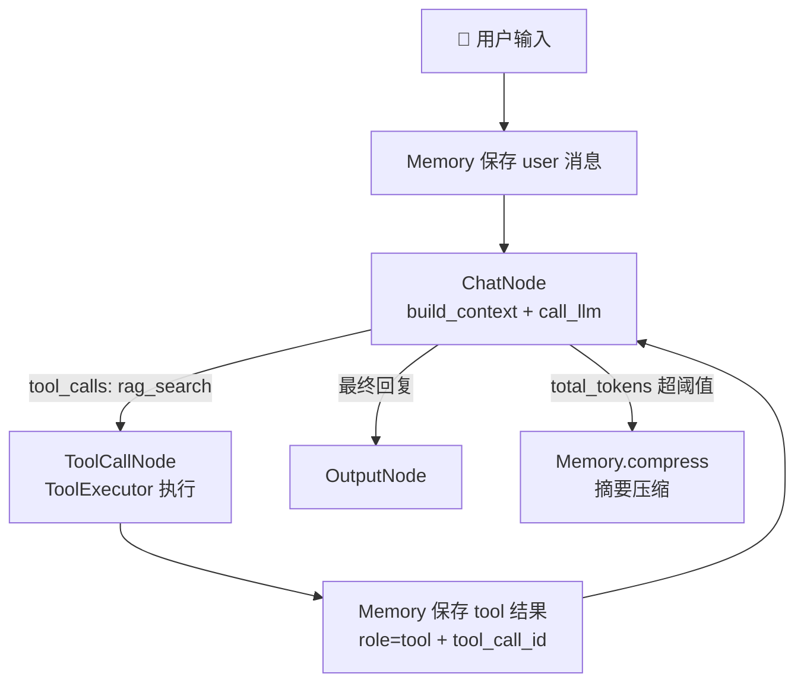

# Agent with RAG - 带本地知识库检索的工具 Agent

这个例子复制自 `examples/chatbot_with_memory`，只多了**一个工具** `rag_search`。

## 功能

- 保留 `read`, `write`, `edit`, `bash`, `grep`, `find`, `ls`, `search` 工具
- 新增 `rag_search`：在本地 Chroma 向量库里做**语义检索**
- 保留 Memory：短期上下文 + 长期记忆 + 自动压缩
- 启动时打印知识库状态，一眼分清「没建库」和「检索没命中」

## 运行

```bash
cd Agent-Learn

# ① 建库（文档变了再跑一次，增量索引只处理变化的文件）
uv run python -m core.rag.index ./README.md ./learn.md ./core ./tools

# ② 对话
uv run python examples/agent_with_rag/main.py
```

## 示例

```text
👤 You: Memory 是怎么防止上下文超长的？
```

期望：模型先调 `rag_search`，再基于检索到的片段回答，并标注来源文件（如 `core/memory.py`）。

## 和 chatbot_with_memory 的差别

**只有三处**，图一行没动：

| # | 改动 | 位置 |
| --- | --- | --- |
| 1 | `SYSTEM_PROMPT` 加一段：本项目相关问题**优先 `rag_search`**，不足再用 grep/read | `SYSTEM_PROMPT` |
| 2 | 启动提示增加「知识库状态」一行 | `describe_knowledge_base()` |
| 3 | `rag_search` 出现在工具列表里 | 由 `get_builtin_tools()` 注册表自动带出 |

## 图为什么不用改



`ToolExecutor.__init__` 用的是 `get_builtin_tools()`，所以**注册即接入**：

```python
chat - "tool_call" >> tool_call
tool_call - "chat" >> chat
chat - "output" >> output
```

这三行和 `chatbot_with_memory` 逐字相同。

## 为什么 RAG 是「一个工具」而不是「一套框架」

- **离线**（一次性）：`chunk → embedding → Chroma`，由 `core/rag/index.py` 完成
- **在线**（每轮对话）：`rag_search` 被 Agent 像 `grep` 一样调用，结果以标准 `role="tool"` 消息回填历史

两条链路只靠 `rag_data/` 这个目录耦合。因为走的是既有 Tool 契约，`Node / Flow / Memory / executor` **一行都不用改**。

## 降级安全

`rag_search` 在三种情况下都不会崩，而是返回文字让模型自己改道：

| 情况 | 返回 |
| --- | --- |
| 没配 `EMBEDDING_*` / 库打不开 | `Error: 向量库不可用（...）` → 模型改用 grep |
| 库是空的 | `知识库为空。请先运行索引命令...` |
| 检索没有命中 | `没有检索到与「...」相关的内容。` |

启动时的 `describe_knowledge_base()` 同样被 `try` 住 —— **没建库不应该让人连对话都进不去**。

## 限制

- 库目录固定在项目内 `rag_data/chroma_db`（实测放系统临时目录会 `os error 5`）
- 换 embedding 模型 = 换向量维度，**必须** `--rebuild` 重建
- 检索结果会永久留在 `session.jsonl` 里，所以输出做了双限额（≤5 块、每块 ≤700 字）
- 没有 rerank、没有 query 改写、没有混合检索——这些是进阶项，见 `RAG.md` 第 12 节
